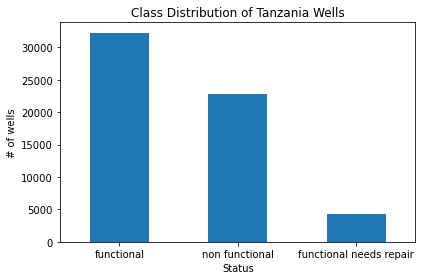

phase_3 project

Analyzing the water pumps' functionality of wells in Tanzania 

Project overview
Tanzania, a country facing challenges in providing clean water to its over 57 million population, struggles with maintaining and repairing existing water wells. This project focuses on constructing a classifier to predict the condition of water wells across the country. By leveraging data encompassing pump types, installation dates, and other pertinent features, the objective is to aid NGOs or the Tanzanian government in identifying wells necessitating repair or maintenance. This initiative aims to enhance water accessibility and availability for the population, especially in remote or underprivileged areas.

Problem Understanding:
Water wells in Tanzania are essential for providing clean water but often suffer breakdowns or inadequate maintenance, impacting water availability. With numerous dispersed wells, systematically identifying non-functional or deteriorating ones is challenging. This project seeks to address this issue by employing machine learning to predict well conditions, facilitating targeted interventions for enhancing water infrastructure.

Project objectives
The main aim is to create a machine learning classifier for predicting water well conditions in Tanzania, classifying wells as functional, needing repair, or non-functional based on historical data. This system aims to assist NGOs and the Tanzanian government in efficiently identifying wells requiring immediate maintenance, ultimately improving water accessibility, especially in underserved regions.

The data. 
In this project i will use data from drivendata.org -https://www.drivendata.org/competitions/7/pump-it-up-data-mining-the-water-table/data/
The data in the datasetcontains information from Taarifa and the Tanzanian Ministry of Water.
With over 59,000 data points.

Methodology
Data Collection and Exploration: Gather diverse water well data in Tanzania. Analyze for patterns and missing values.

Feature Engineering and Preprocessing:

- Modify and prepare data for modeling.Have a base model so as to see how preprocessing affect the model

Model Selection and Training:

- Evaluate various machine learning algorithms through preprocessing and training using different classifiers to find the best classifier.

CONCLUSION

- Most of the functional wells are found in the city where people mostly pay to use them. More wells similar to those in the city should be built in other region with focus on pumps that will work on gravity.

- The wells that were recorded a long time ago most are non functional and in need of repairs this is to show they have been neglected.

- Wells that run on soft water sources the most functional.

RECOMMENDATION

- Build more wells resembling those in urban areas in other regions that experience water shortage, especially focusing on implementing pumps that operate using gravity and have soft water sources. This replication strategy might enhance the functionality of wells in other areas 
- Increase attention and maintenance of older wells to prevent deterioration 

NEXT STEPS
- Further exploration into wider scopes of data and analysis of different features on how they affect functionality
- Develop a strong strategy on well maintenance and repairs
- Implement recommendations

